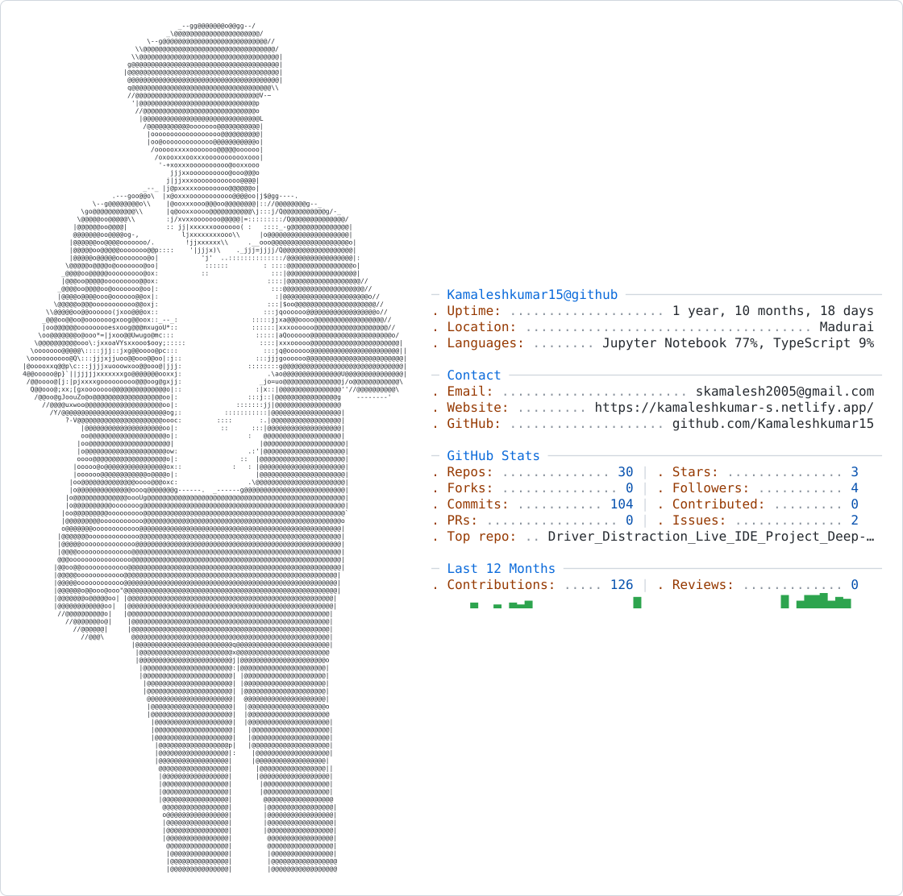

<!-- ========================================================= -->

<!--                         HEADER                            -->

<!-- ========================================================= -->

<!-- Optional profile image:

-->

<!-- ========================================================= -->

<!--                   LIGHT / DARK MODE                      -->

<!-- ========================================================= -->

<picture>
  <source
    media="(prefers-color-scheme: dark)"
    srcset="./dark_mode.svg"
  />
  <source
    media="(prefers-color-scheme: light)"
    srcset="./light_mode.svg"
  />
  
</picture>

 

<!-- ========================================================= -->

<!--                    TYPING ANIMATION                      -->

<!-- ========================================================= -->

 
 

<!-- ========================================================= -->

<!--                     SOCIAL LINKS                         -->

<!-- ========================================================= -->

 
 

<!-- ========================================================= -->

<!--                       ABOUT ME                            -->

<!-- ========================================================= -->

👾 Who Am I?

kamalesh = {
    "name": "Kamalesh Kumar S",

    "role": [
        "Software Developer",
        "Business Analyst",
        "Aspiring AI Engineer"
    ],

    "degree": "B.Tech – Artificial Intelligence & Data Science",

    "cgpa": "8.0 / 10",

    "college": "Erode Sengunthar Engineering College",

    "location": "Tamil Nadu, India",

    "status": "Building, learning and shipping AI-focused projects",

    "focus": [
        "Artificial Intelligence",
        "Machine Learning",
        "Generative AI",
        "AI Agents",
        "Prompt Engineering",
        "AI Automation",
        "Computer Vision",
        "Software Development"
    ],

    "workflow": [
        "research",
        "prototype",
        "experiment",
        "debug",
        "automate",
        "ship"
    ],

    "vibe": "research → prototype → automate → ship",

    "fun_fact": "I treat debugging like a detective case 🕵️"
}

 

<!-- ========================================================= -->

<!--                     TECH STACK                           -->

<!-- ========================================================= -->

🛠️ Tech Stack

The right tools turn ideas into intelligent, working systems.

💻 Programming & Core CS

  
  
  
  
  

🤖 AI & Machine Learning

  
  
  
  
  
  
  

⚙️ AI Agents & Automation

  
  
  
  

🌐 Web & Full Stack

  
  
  
  

📊 Data & Notebooks

  
  
  
  
  

<!-- ========================================================= -->

<!--                  PROFESSIONAL EXPERIENCE                 -->

<!-- ========================================================= -->

💼 Professional Experience

🏢 Role

📅 Duration

🏭 Organization

Artificial Intelligence Intern

Jan 2026 – Feb 2026

Novitech R&D Private Limited

Web Development Intern

May 2025 – Jul 2025

Intopz Technologies Private Limited

🤖 Artificial Intelligence Intern — Novitech R&D Private Limited

Researched and built AI agent workflows using LangChain, Hugging Face Transformers, and API integrations.

Implemented Machine Learning models and applied Prompt Engineering techniques to enhance task automation.

Developed and tested intelligent automation pipelines using n8n to streamline repetitive data workflows.

Collaborated with the R&D team to evaluate custom LLM performance and optimize response accuracy.

💻 Web Development Intern — Intopz Technologies Private Limited

Designed, developed, and deployed full-cycle responsive web applications.

Integrated AI-powered development utilities to streamline code generation, debugging, and build deployments.

Evaluated 30+ professional AI tools to increase workflow productivity and optimization pipelines.

Implemented modern software engineering practices, participating in active project debugging and technical reviews.

Collaborated with senior mentors in an agile framework to gain industry-standard development exposure.

<!-- ========================================================= -->

<!--                     FEATURED PROJECTS                     -->

<!-- ========================================================= -->

🚀 Featured Projects

🏆 Project

💡 What it does

⚡ Stack

AI-Powered Job Search Automation Agent

Automated job search & aggregation with AI-based filtering and matching

n8n · APIs · Google Workspace

Gen AI Customer Review Analyzer

Multilingual e-commerce review analysis with translation + sentiment models

Python · Hugging Face · Gradio · Pandas

Safe Aura – Women Safety Platform

Government project: live SOS alerting portal for district police

Hardware + Web Stack

🔍 AI-Powered Job Search Automation Agent

Designed and developed an automated job search and aggregation system utilizing n8n, APIs, and Google Workspace.

Implemented intelligent AI-based filtering and job matching algorithms to deliver personalized recommendations.

Streamlined the placement process for students by integrating automated email notifications and cloud-based data storage.

🗣️ Gen AI Customer Review Analyzer

Developed a Generative AI-powered analysis system using Python, Hugging Face, and Google Colab to process multilingual e-commerce reviews from Amazon, Flipkart, and Meesho.

Integrated automated language translation with deep learning sentiment analysis models to classify feedback.

Built an interactive Gradio web app featuring automated data visualization with Matplotlib and dataset handling with Pandas.

Tech used: Python, Google Colab, Gradio, Hugging Face Transformers, Pandas, Matplotlib, TextBlob, OpenPyXL.

🚨 Safe Aura – Women Safety Platform (Government Project)

Engineered a women's safety portal for the Thoothukudi District Police leveraging hardware and web technologies.

Architected a live SOS communication link triggering alerting workflows through an administration dashboard.

Deployed the operational architecture to facilitate stable alert pathways between regional users and field authorities.

<!-- ========================================================= -->

<!--                         EDUCATION                         -->

<!-- ========================================================= -->

🎓 Education

🏫 Institution

🎓 Program

📅 Duration

📊 Score

Erode Sengunthar Engineering College

B.Tech – Artificial Intelligence & Data Science

Sept 2023 – May 2027

CGPA 8.0 / 10

Thaai Matric Higher Secondary School

Higher Secondary Certification (HSC)

Completed Apr 2023

—

<!-- ========================================================= -->

<!--                CERTIFICATIONS & ACHIEVEMENTS              -->

<!-- ========================================================= -->

🏅 Certifications & Achievements

🏆 Google Developer Groups Recognition — Awarded for campus developer community leadership.

🧩 LeetCode Problem Solving — Multiple solution badges tracking algorithmic problem-solving consistency.

☁️ Web Development (Coursera) — Specialization credential in Amazon Web Application Development.

<!-- ========================================================= -->

<!--                       GITHUB STATS                       -->

<!-- ========================================================= -->

📊 GitHub Stats

 

  

<!-- ========================================================= -->

<!--                    CONTRIBUTION GRAPH                    -->

<!-- ========================================================= -->

📈 Contribution Graph

<!-- ========================================================= -->

<!--                      DAILY ACTIVITY                      -->

<!-- ========================================================= -->

📦 Daily Activity

<!-- ========================================================= -->

<!--                 PRODUCTIVITY & PATTERNS                  -->

<!-- ========================================================= -->

⚡ Productivity & Dev Patterns

🌅  Morning      ██████░░░░░░   planning, learning & getting started
🌞  Afternoon    ████████████   deep work: coding + research
🌆  Evening      ██████████░░   AI agents + automation + debugging
🌙  Night        ████████░░░░   reading, experimenting & building

🔥 How I Work

Habit

Reality

🧠 Planning

Breaking problems into agent-sized tasks

💻 Coding

Python-first, automation-minded

🐛 Debugging

Detective mode — trace it before it traces me

🤖 Automating

If I do it twice, I look for a way to automate it

📝 Documentation

Written after the demo works 😅

<!-- ========================================================= -->

<!--                         2026 GOALS                        -->

<!-- ========================================================= -->

🎯 2026 Goals

🤖 Build and ship AI agent workflows using LangChain & Hugging Face

⚙️ Design intelligent automation pipelines with n8n

🏛️ Contribute to a real-world government-facing project (Safe Aura)

🧠 Build an end-to-end Generative AI product used by real users

📦 Ship a multi-agent system with production-grade reliability

🌍 Land a strong AI/Software internship or full-time role

⭐ Cross 50+ solved problems across LeetCode & HackerRank consistently

<!-- ========================================================= -->

<!--                    OPEN TO OPPORTUNITIES                  -->

<!-- ========================================================= -->

💌 Open to Opportunities

Actively looking for AI/ML internships, software development roles & collaborations.

If you're building something intelligent — let's talk 👇

 

 
 

<!-- ========================================================= -->

<!--                         QUOTE                             -->

<!-- ========================================================= -->

 

<!-- ========================================================= -->

<!--                         FOOTER                            -->

<!-- ========================================================= -->

